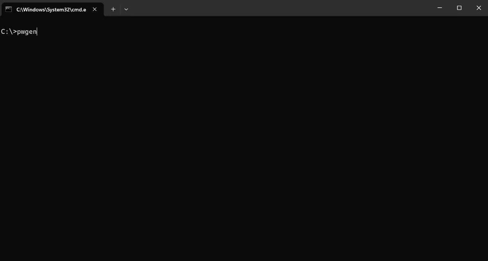

# Password Generator CLI

A cross-platform command-line tool for generating secure passwords.

## Example



## Installation

### Prerequisites
- .NET 8.0 SDK or later

### Install from NuGet
```bash
dotnet tool install --global PasswordGenCLI
```

### Manual Installation
1. Clone the repository
2. Run in the project directory:
```bash
dotnet pack
dotnet tool install --global --add-source ./nupkg PasswordGenCLI
```

## Usage

Generate a password with default settings (14 characters):
```bash
pwgen
```

Specify password length:
```bash
pwgen -l 16
pwgen --length 20
```

Include special characters:
```bash
pwgen -u
pwgen --use-symbols
```

Custom special characters:
```bash
pwgen -s "#$%" -u
pwgen --symbols "@!%" --use-symbols
```

Show help:
```bash
pwgen --help
```

## Uninstallation
```bash
dotnet tool uninstall -g PasswordGenCLI
```

## Platform Support
- Windows
- macOS
- Linux

## License
MIT
